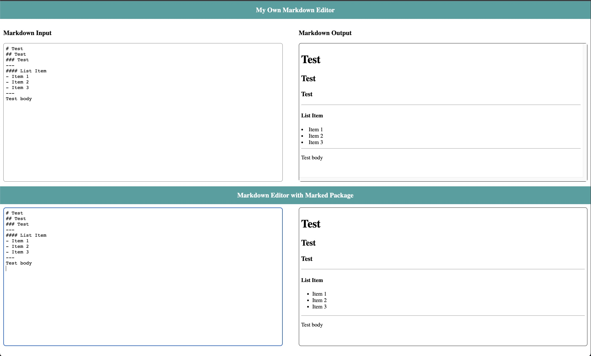

## Indigo Markdown Editor Challenge

Welcome to the [Indigo Ag](https://www.indigoag.com/about) React Code challenge.

## Goal

Our goal is to build a minimal Markdown Editor that implements a tiny subset of the
[commonmark spec](https://commonmark.org/help/). It should only take about 1-2 hours to complete.

The template contains a text input area and an output area into which to render the formatted
markdown. Our goal is to build something akin to [this](https://markdownlivepreview.com/).

## Acceptance Criteria

- When text is entered in the input area it appears in the output area.
- When text is separated by an empty new line, it get's rendered into a new block. By default we use
  `p` for blocks.
- When a line starts with `#` and `##` it is rendered in a `h1` and `h2` block respectively.
- When a line starts with `---` a `hr` element is rendered.

## Guidance

We are using React and you are free to use any CSS solution you like and install small helper
libraries like lodash, but keep dependencies to an absolute minimum.

Keep the implementation simple, there are no bonus points for implementing more than what is
required, we just want to see your ability to write clean JavaScript code, use React, and reason
about some logic. You can put everything into the `App.tsx` file.

Please timebox yourself to 1-2 hours and commit regularly.

## Development Environment

This is a regular stripped down [Create React App](https://create-react-app.dev) project with typescript:

- Run `npm start` to start the app in development mode on [http://localhost:3000](http://localhost:3000).
- Run `npm test` to run tests, [React Testing Library](https://testing-library.com/docs/react-testing-library/) is already set up.

## Submission

To submit your solution please create a **private** repository on GitHub, upload your code, and
invite [@mrloh](https://github.com/mrloh/) as a collaborator.

---

## Challenge Finished

